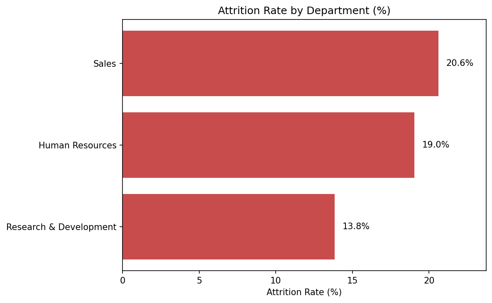
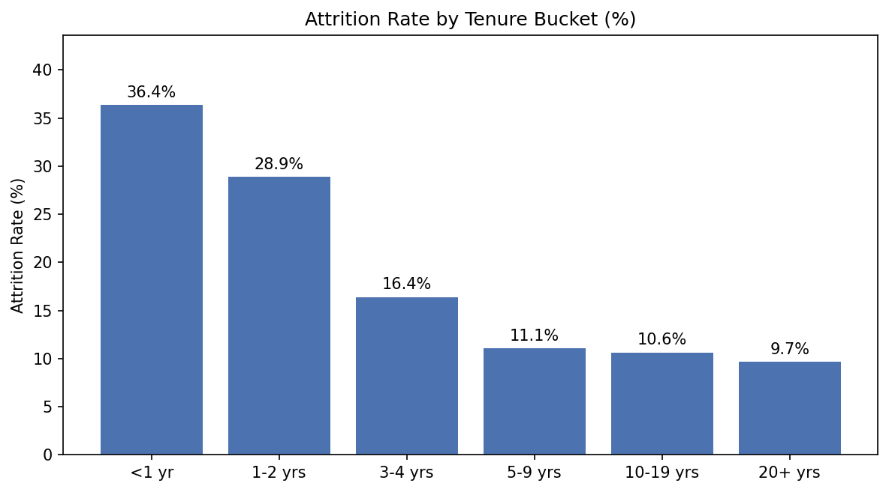
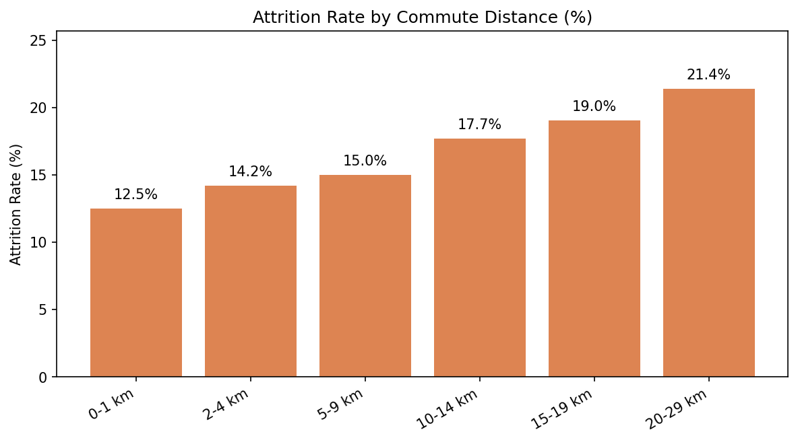

HR Attrition Analysis Notebook
================================

Overview
--------
- Interactive, bilingual (English/Hebrew) HR analytics notebook that explores employee attrition drivers and HR KPIs.  
- Primary deliverable: `phyton_project_final.ipynb`, which merges multiple HR tables, cleans features, performs exploratory analysis, and summarizes insights plus recommendations.

Repository Contents
-------------------
- `phyton_project_final.ipynb` – main polished analysis used for presentations.  
- `phyton_project .ipynb` – earlier working version kept for reference.  
- `connect_mysql.ipynb`, `HRDB.sql`, `hrdb2.xlsx` – data acquisition assets (SQL schema, Excel export).  
- `how_to_analyze_dataset.pdf`, `HR_Pyhotn_Final_Project.pdf` – supporting documentation and slides.

Requirements
------------
- Python 3.10+  
- Packages: `jupyterlab` or `notebook`, `pandas`, `numpy`, `matplotlib`, `seaborn`, `openpyxl` (for Excel I/O).  
- Optional: Power BI/Slide tools if you want to reuse the presentation artifacts.

Quick Start
-----------
1. Create & activate a virtual environment (example using `venv`):
   ```
   python -m venv .venv
   .venv\Scripts\activate
   pip install -U pip
   pip install jupyterlab pandas numpy matplotlib seaborn openpyxl
   ```
2. Ensure `hrdb2.xlsx` sits under `CSV & EXCEL TABLES/` relative to the project root (or update `file_path` in the notebook).  
3. Launch Jupyter and open the notebook:
   ```
   jupyter lab phyton_project_final.ipynb
   ```
4. Run the cells top-to-bottom; markdown cells outline the bilingual narrative and table-of-contents links.

Key Visuals
-----------
**Attrition by Department / נטישה לפי מחלקה**  
  
- Sales shows the steepest attrition (~20.6%), HR follows (~19%), while R&D remains comparatively stable (~13.8%).  
- מחלקת המכירות מובילה בנטישה (~20.6%), משאבי אנוש מאחוריה (~19%), ומו״פ יציבה יותר (~13.8%).

**Attrition by Tenure / נטישה לפי ותק**  
  
- More than a third of employees with <1 year of service leave (36%), but attrition drops below 11% once tenure exceeds five years.  
- מעל שליש מהעובדים בשנה הראשונה עוזבים (36%), אך שיעור הנטישה יורד אל מתחת ל‑11% לאחר חמש שנות ותק.

**Attrition by Commute Distance / נטישה לפי מרחק נסיעה**  
  
- Attrition climbs steadily from 12.5% among employees living 0–1 km away to 21.4% for those commuting 20–29 km.  
- שיעור הנטישה מטפס מ‑12.5% עבור מי שגר במרחק 0–1 ק״מ ועד 21.4% לעובדים שנוסעים 20–29 ק״מ לעבודה.

Notebook Roadmap
----------------
- **Introduction & Objectives** – business framing, scope, and key assumptions.  
- **Imports & Settings** – library setup and Excel path definitions.  
- **Data Loading & Overview** – merges the two HR sheets on `EmployeeNumber`, inspects schema, and creates `Attrition_Flag`.  
- **Cleaning & Preparation** – removes constant columns, checks duplicates/missing data, and prepares analytical features.  
- **Exploratory Data Analysis** – visual and tabular summaries for satisfaction metrics, tenure, compensation, overtime, and more.  
- **Insights, Conclusions, Recommendations** – highlights drivers of attrition and suggested HR actions.

Insights & Conclusions
----------------------
- **Early tenure risk / סיכון בשנה הראשונה:** 36% of sub‑1‑year employees churn, making onboarding the most fragile stage of the lifecycle. השנה הראשונה היא הקריטית ביותר לשימור.  
- **Department hot spots / מחלקות בסיכון:** Sales and HR face ~20% attrition versus ~14% in R&D, indicating targeted engagement is required במכירות ובמשאבי אנוש.  
- **Commute fatigue / עומס נסיעה:** Attrition almost doubles between the 0–1 km (12.5%) and 20–29 km (21.4%) commute bands, underscoring the value of hybrid policies לעובדים רחוקים.  
- **Development matters / חשיבות ההכשרה:** Employees without any training show 27.8% attrition while even one annual session drops the rate to 12.7%, כך שהשקעה בהדרכות תומכת בשימור.  
- **Tenured stability / יציבות עובדים ותיקים:** Staff with 10+ years of service churn at ~10%, forming a core talent segment worth protecting.

Action Items
------------
- **Targeted onboarding & mentorship / ליווי ממוקד לעובדים חדשים:** Pair every first‑year employee with a mentor, add 30‑60 day pulse surveys, and intervene before engagement dips.  
- **Hybrid & commute relief / פתרונות לעומסי נסיעה:** Prioritize remote days, staggered shifts, or shuttle stipends for employees traveling 15+ km to curb the 21% attrition spike.  
- **Learning commitments / מחויבות להכשרה:** Guarantee at least one structured learning opportunity per employee each year to cut attrition risk in half (27.8% → 12.7%).  
- **Career pathing & rewards / מסלולי קידום ושכר:** Communicate transparent promotion paths, keep compensation benchmarks current, and use selective retention bonuses for Sales/HR critical roles.

Reproducibility Tips
--------------------
- Keep raw sources read-only; derive new datasets in separate files or sheets.  
- When adapting to new HR snapshots, verify column names align before running the merge step.  
- Refresh plots after any filtering tweaks to avoid stale visuals in exported reports.

Contributing / Next Steps
-------------------------
- Expand with predictive modeling (e.g., classification baselines) or cohort dashboards.  
- Localize additional markdown if you need deeper Hebrew context.  
- When making changes, duplicate the notebook or use git branches to preserve the delivered version.

